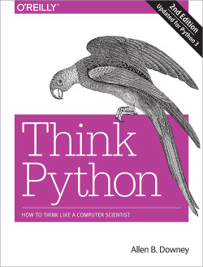

# Introduction to Pre Programming 2019
สวัสดีครับน้อง ๆ ❤️
 
พี่ ๆ ก็ขอต้อนรับน้อง ๆ อีกครั้งนึงนะครับ Repo นี้จะบอกเกี่ยวกับกำหนดการและข้อมูล Pre-Programming Preparatory Course ของปี 2019 นะครับ โดยการอัปเดตเรื่องกำหนดการและข้อมูลต่าง จะใช้ Repo นี้เป็นตัวหลักนะครับ
 
 
คอร์สนี้จะเป็นเรื่องการใช้ Algorithm และ Basic Programming ซึ่งภาษาหลักของเราที่จะใช้นั้นก็คือ Python นั้นเอง โดยทั้ง 2 อย่างนั้นจะเป็นพื้นฐานหลักในวิชา Problem Solving in Information Technology (PSIT) ในปี 1 เทอม 1

# กำหนดการ Pre-Programming

|วันที่ 8 พฤษภาคม - 19 พฤษภาคม 2019|วันที่ 20 พฤษภาคม - 7 มิถุนายน 2019|วันที่ 10 มิถุนายน - 5 กรกฎาคม 2019 |
|:-------:|:----:|:-------:| 
|รับสมัครน้อง ๆ เข้า Course Pre-Programming (รับสมัครผ่านทาง Google Form)|Pre-Programming รอบ Online (ผ่านระบบ eJudge)|Pre-Programming รอบ Onsite (ณ คณะเทคโนโลยีสารสนเทศ)|
|Status: `INACTIVE` | Status: `INACTIVE` | Status: `INACTIVE`|

> เปิดรับสมัครเร็ว ๆ นี้

# What is eJudge?

น้อง ๆ คงสงสัยว่าระบบ eJudge ที่พี่กล่าวถึงนั้น คืออะไร ?

ระบบ eJudge เป็นระบบ Grader ชนิดหนึ่ง ที่จะรับโปรแกรมของน้อง ๆ มา แล้วรัน โดยการใส่ค่า Input ที่พวกพี่ ๆ ที่ออกโจทย์เขียนเอาไว้ และรับค่า Output ที่ผ่านโปรแกรมนั้น ๆ ออกมา
โดยระบบจะสามารถเช็คได้ถึง

* **ความมีระเบียบ** ในการเขียนโปรแกรม (คุณภาพ)
* **ความคล้ายคลึงใน Algorithm** ในโปรแกรมน้อง ๆ กับเพี่อนของน้อง ๆ
* **ความถูกต้องในผลลัพท์** ที่ออกมาจากโปรแกรมที่น้อง ๆ เขียนมา
* **เก็บคะแนน** และเก็บไฟล์ที่น้องเคยส่งมาทั้งหมด

> [ E-Judge Grader ITKMITL ](https://ejudge.it.kmitl.ac.th/)

โดยน้อง ๆ ก็จะเจอกับระบบนี้ไปอีกนาน เพราะน้องต้องเรียนกับมัน สอบกับมัน ทำ Quiz กับมัน ดังนั้น พี่อยากให้น้องทำความเข้าใจและทำตัวให้ชินไปกับระบบนี้นะครับ

วิธีที่ระบบ eJudge คำนวณคะแนน พี่จะยกตัวอย่างให้ว่า

หากน้องทำได้เพียง 9 ใน 10 testcase ได้ถูกต้อง และคะแนนต่อข้อ = 100 คะแนน และระดับความยาก = 5 และ ทำคุณภาพ code ระดับไม่มีที่ติ

|Testcase Score|Difficulty|Perfect Bonus score|Quality|Total|
|:------------:|:----------:|:-------------------:|:-------:|:-----:|
|(9/10) x 100  |x5        |100 x 5 x 0        |100%   |90 x 5 x 1 + 0 = 450|

หากน้องทำได้ 10 ใน 10 testcase ได้ถูกต้อง และคะแนนต่อข้อ = 100 คะแนน
และระดับความยาก = 5 และ ทำคุณภาพ code ระดับไม่มีที่ติ

|Testcase Score|Difficulty|Perfect Bonus score|Quality|Total|
|:------------:|:--------:|:-----------------:|:-----:|:---:|
|(10/10) x 100 |x5        |100 x 5 x 2        |100%   |100 x 5 x 1 + 500 = 1000|

> เห็นความแตกต่างนั้นมั้ยเอ่ย? 450 กับ 1000 คะแนน มันต่างกันมากเลยนะครับ
 

* **Testcase** คือ กรณีที่นำมาทดสอบ
* **Difficulty** คือ ระดับความยากของโจทย์
* **Perfect Bonus** คือ คะแนน Bonus เมื่อทำถูกทุก Testcase
* **Quality** คือ ความเป็นระเบียบของ Code
* **Total** คือ คะแนนรวมทั้งหมด

> ซึ่ง **Testcase, คะแนน หรือระดับความยาก** จะขึ้นอยู่กับผู้ออกโจทย์ โจทย์บอกข้ออาจมี 1000 คะแนนก็ได้

# Why Python?

น้อง ๆ อาจจะไม่เข้าใจ ว่าทำไมเราต้องมาเรียน Python ด้วย ทำไมไม่เรียน C/Java ก่อน หรือ ไม่เรียน Ruby หรือ Swift ก่อน เพื่อเป็นการเรียนวิธีคิด พี่อยากจะบอกข้อดีของ Python ให้น้องฟังครับ

- **Speed** - น้องจะสามารถเขียนภาษานี้ได้เร็ว เพราะเป็นภาษา High Level

- **Integrations** - ระบบต่าง ๆ นั้นรองรับภาษา Python ทั้งหมด หากไม่รองรับ ก็สามารถใช้ Library เพื่อให้มันรองรับได้

- **Compatibility** - ใช้ได้กับทุกแพลตฟอร์มหลัก ๆ เช่น Windows และ UNIX (MacOS & Linux Distribution & Android)

> "Python is easy to learn and use, but powerful enough to tackle even the most difficult problems. It integrates well with existing IT infrastructure, and is very platform independent." - Continuum

# เนื้อหาการเรียนรอบ Online

> ## References
>
> 
>
> Python Organizations (Document หลักของ Python)  
> https://docs.python.org/3/
>
> Think Python 2e (หนังสือเดียวที่เอาเข้าห้องสอบได้)  
> http://greenteapress.com/thinkpython2/thinkpython2.pdf
>
> Python Tutor (Python Cloud Debugger ทำงานทีละบรรทัด)  
> http://www.pythontutor.com
>

---
# การเตรียมตัวก่อน Onsite

## เรียน Onsite
การเรียน Onsite นี้จะแตกต่างกับรอบ Online ในระดับหนึ่ง เพราะจะเป็นการใช้เครื่องมือที่หลากหลายขึ้น (หรือในท่าที่ยากขึ้น) ต่างจากรอบ Online ซึ่งพี่ ๆ จะฝึกให้น้อง ๆ ได้ฝึกวาง Algorithm ให้เป็น และใช้เครื่องมือได้
> อัลกอริทึม (algorithm) หมายถึง กระบวนการแก้ปัญหาที่สามารถเข้าใจได้ มีลำดับหรือวิธีการในการแก้ไขปัญหาใดปัญหาหนึ่งอย่างเป็นขั้นเป็นตอนและชัดเจน เมื่อนำเข้าอะไร แล้วจะต้องได้ผลลัพธ์เช่นไร  
> สรุปง่ายๆ อัลกอรึทึมก็คือวิธีการคิดนั่นเอง ซึ่งอัลกอริทึมของแต่ละคนจะไม่เหมือนกัน อยากให้น้อง ๆ ทำความเข้าใจกับอัลกอริทึมให้ดี เพราะเป็นสิ่งที่จำเป็นมากสำหรับการเขียนโค้ด เพื่อแก้โจทย์ต่างๆ

## มา Onsite กันเถอะ

การเรียน Onsite จะเรียนทั้งหมด 4 Week จันทร์ - ศุกร์ เริ่ม วันที่ 10 มิถุนายน ถึง 5 กรกฎาคม 2019 ซึ่งการเรียน Onsite นั้นจัดขึ้นที่คณะเทคโนโลยีสารสนเทศ

การเรียน Onsite ให้ใส่ชุดธรรมดาสุภาพเรียบร้อย
* เสื้อยืดหรือเสื้อที่มันสุภาพ ๆ
* กางเกงขายาว
* รองเท้าผ้าใบ

สิ่งที่ต้องเตรียมมาเรียน Onsite
* สมุด และ ปากกา สำหรับจดเนื้อหา

>โดยหากมีข้อสงสัย หรือ ต้องการความช่วยเหลือ ติดต่อพี่ ๆ ได้เลยนะครับ

## การเดินทาง
### สำหรับสถานีสำคัญต่างๆ

#### อนุสาวรีย์ชัย/พญาไท 
* นั่งรถตู้สาย 156 เขียนว่าไปเทคโนลาดกระบัง
หรือใครจะนั่งรถไฟมาก็ได้นะ ขึ้นตรงที่หยุดพญาไท ใต้ BTS พญาไท ลงหัวตะเข้นะน้อง

#### หมอชิต 2/บางซื่อ 
* นั่งรถตู้สาย 144 เขียนว่าไปเทคโนลาดกระบัง

#### รังสิต/ฟิวเจอร์/ปทุมธานี 
* นั่งรถตู้สาย 554A เขียนว่าไปเทคโนลาดกระบัง (รถจอดหน้าฟิวเจอร์เลย)

#### แฮปปี้แลนด์/บางกะปิ/ลาดพร้าว
* นั่งรถตู้สาย 50B เขียนว่าไปเทคโนลาดกระบัง(รถจอดข้างห้างน้อมจิตต์) 

#### ซีคอนสแควร์/สวนหลวง
* นั่งรถตู้สาย ที่เขียนว่าไปเทคโนลาดกระบัง หรือ ซีคอน-หัวตะเข้ (รถจอดฝั่งตรงข้ามห้างซีคอน) หรือใครจะนั่ง 1013 มาก็ได้นะ มาต่อหัวตะเข้อีกที

#### สายใต้ใหม่/ตลิ่งชัน
`อันนี้ค่อนข้างโหดนิดนึงนะ`

1. สายราง 
*ขึ้นรถไฟตรงสถานีชุมทางตลิ่งชัน ต่อเข้ากรุงเทพ (ก็คือมาลงที่หัวลำโพง) แล้วค่อยต่อรถไฟอีกต่อมาลงหัวตะเข้
2. สายด่วน 
*นั่งรถตู้อะไรก็ได้มาลงอนุสาวรีย์ชัย แล้วต่อรถตู้ที่พี่เขียนไว้ข้างบนได้เลย~

### สำหรับคนใกล้แนวรถไฟฟ้า
นั่งรถไฟฟ้ามาต่อ Airport Link ที่ BTS พญาไท แล้วลงที่สถานีลาดกระบัง เสร็จแล้วมาต่อ 2 แถวที่เขียนว่า 
เข้าเทคโนได้เลย แล้วรถจะผ่านหน้าคณะ (อย่าลืมกดกริ่งจอดนะ พี่เตือนแล้วนะ! เกือบเลยมาแล้วนะ!)

### สำหรับโซนนอกเมืองอื่นๆ
* ฉะเชิงเทรา 
รถไฟเร็วที่สุด ลงหัวตะเข้ 
* มีนบุรี 
รถตู้สาย 1517/23A* เขียนว่าไปเทคโนลาดกระบัง รถจอดตรงข้างอู่รถเมล์ 
*บางคันไปไม่ถึง ถามคนขับด้วยนะ 
* ปากน้ำ/บางนา 
นั่งรถมาลงตรง BTS พระโขนง แล้วต่อ 1013 โลด ต่อสองแถวตรงหัวตะเข้อีกที 
* หลักสี่/ดอนเมือง 
รถเมล์ 554 เร็วสุด มีพี่นั่งมาแล้ว ไปต่อมีนบุรีมันช้ากว่า รถจะสุดทางที่สนามบิน ให้นั่งรถเวียนออกมาแล้วนั่งสองแถวต่อเข้าไปอีกที 

### สำหรับคนใกล้เทคโน

สองแถว ปี้นๆ เยอะมาก ถ้าไม่มีมาไปเทคโนเลย ก็ให้นั่งที่เขียนว่าหัวตะเข้ก็ได้ แล้วก็นั่งรถต่อเข้าไปอีกที ไม่ก็พี่วินเลยค้าบ

### สำหรับคนไม่รู้ทางเลย

ถามพี่ ๆ ได้นะ พี่ ๆ ทุกคนใจดี จริงง
จริ๊งงงงงง

## หาที่อยู่ (หอพัก) ** ควรรีบหาแล้วนะเดี๋ยวจะไม่มีที่นอน เตือนแล้วนะ!
สำหรับน้องที่มาจากต่างจังหวัดหรือมีประสงค์ที่จะพักแถวสถาบันพี่ก็มีโซนแนะนำหลักๆ ดังนี้

1. เกกี [อยู่แถวนี้](https://goo.gl/maps/pX5ARMGMNZ62)
2. หอพักของมหาลัย [อยู่แถวนี้](https://goo.gl/maps/kaqZHBVJKYB2)
3. หน้ามหาลัย [อยู่แถวนี้](https://goo.gl/maps/NdyzVqv88iw)
4. RNP [อยู่แถวนี้](http://bit.ly/2vkF7Wz)
5. V Condo [อยู่แถวนี้](https://goo.gl/maps/Yr212K2WBxK2)

___
## Special Thanks
||
|:-:|
|[@RawitSHIE](https://github.com/rawitshie)|

## Teaching Director
||||||
|:-:|:-:|:-:|:-:|:-:|
|P'Meen|P'Mai|P'Pat|P'Puu|P'Pee|

||||||
|:-:|:-:|:-:|:-:|:-:|
|P'Pipu|P'Shine|P'Win|P'Mookmix|P'Ja|
